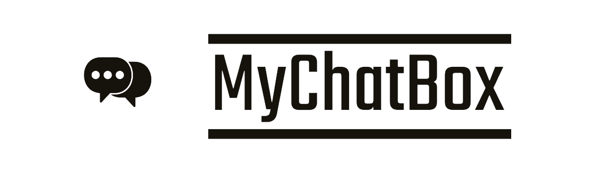

<p align="center">
  
</p>

# <p align="center">MyChatBox</p>

Welcome to MyChatBox! A real-time chat application where users can create chatrooms, send messages, and stay connected with their friends and colleagues. Built with Vue.js and Firebase, MyChatBox ensures a seamless chatting experience with real-time updates and notifications.

## Features

- **Real-time Messaging**: Enjoy real-time messaging with instant updates.
- **Public and Private Chatrooms**: Create and join both public and private chatrooms.
- **User Authentication**: Secure user authentication with Firebase.
- **Notifications**: Receive notifications for new messages and activities.
- **User Profiles**: Create and update user profiles with avatars and bios.
- **Responsive Design**: Fully responsive design for both desktop and mobile devices.

## Deployed Link

Check out the live version of MyChatBox: [MyChatBox Deployed Link](#)

## Technology Stack

- **Frontend**: Vue.js
- **Backend**: Firebase Firestore
- **Authentication**: Firebase Auth
- **Hosting**: Firebase Hosting

## Getting Started

1. **Clone the repository**:

    ```bash
    git clone https://github.com/yassine22-alt/chat-online.git
    cd chat-online
    ```

2. **Install dependencies**:

    ```bash
    npm install
    ```

3. **Run the application in development mode**:

    ```bash
    npm run serve
    ```

4. **Build the application for production**:

    ```bash
    npm run build
    ```

5. **Lint and fix files**:

    ```bash
    npm run lint
    ```

## Customize Configuration

For detailed explanation on how things work, check out the [Vue CLI Configuration Reference](https://cli.vuejs.org/config/).


## Contact

If you have any questions, please contact us at [yassine.blali@um6p.ma](mailto:yassine.blali@um6p.ma) or [malak.kably@um6p.ma](mailto:malak.kably@um6p.ma)
